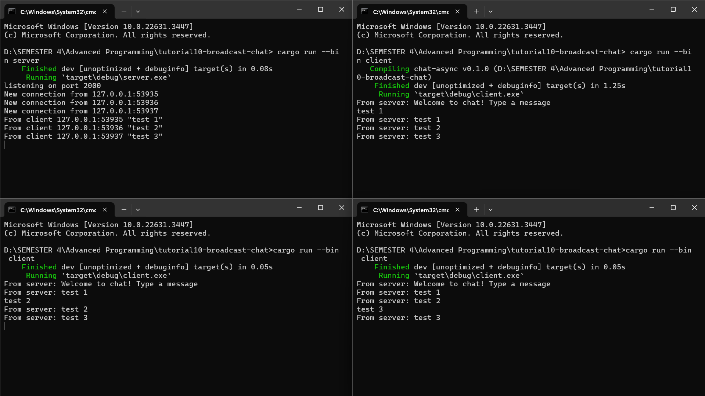
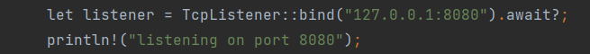
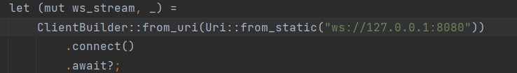
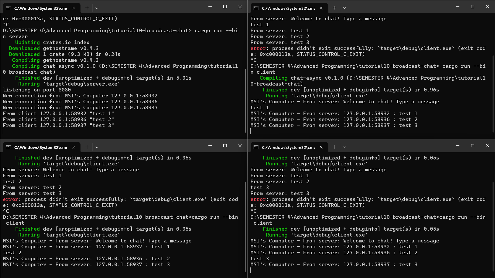

# Modul 10 - Broadcast-chat
**Arju Naja Muhammad - 2206082045**

## Experiment 2.1: Original code, and how it run

Ketika saya mencoba menjalankan satu server dan tiga client, lalu menuliskan pesan pada setiap client, pesan yang saya tulis akan dikirimkan ke server, dan server akan mengirimkan pesan tersebut ke semua client. Isi dari pesan yang ditampilkan oleh setiap client dan server dapat dilihat pada gambar di atas.    
## Experiment 2.2: Modyfing port

 

 
Terdapat keharusan untuk mengubah kedua bagian tersebut agar klien dan server dapat saling berkomunikasi melalui port yang sama. Jika port pada klien dan server tidak konsisten, klien tidak akan berhasil terhubung ke server. Dalam kedua berkas tersebut, host yang digunakan untuk komunikasi didefinisikan di dalam fungsi utama (`main`). Namun, pada berkas `server.rs`, tidak terlihat penggunaan protokol Websocket karena URL listener tidak diawali dengan `ws://`. Dengan demikian, server menggunakan `TcpListener`, menunjukkan bahwa protokol yang digunakan adalah TCP.    

## Experiment 2.3: Small changes, add IP and Port
  

Pada gambar di atas, telah diuji server dan klien yang telah ditambahkan informasi Hostname, IP, dan port di kedua sisi. Untuk memperoleh Hostname, saya menggunakan paket `gethostname`, kemudian menambahkan variabel `hostname = gethostname().into_string().unwrap_or_else(|_| "unknown".to_string());` yang saya gunakan pada bagian `println!` untuk menampilkan Hostname.
